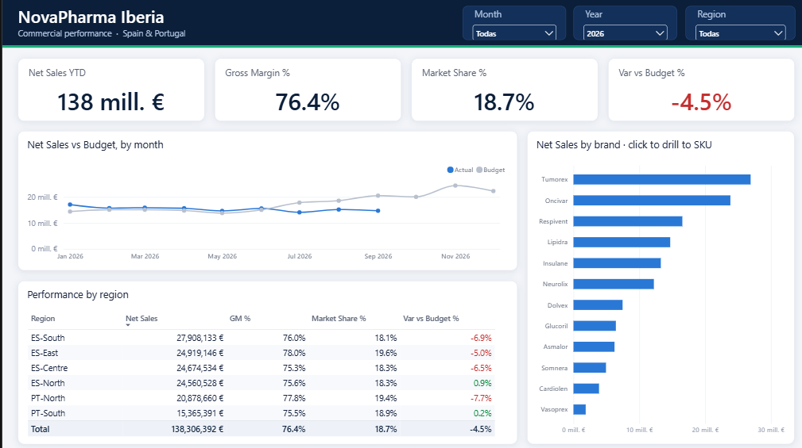
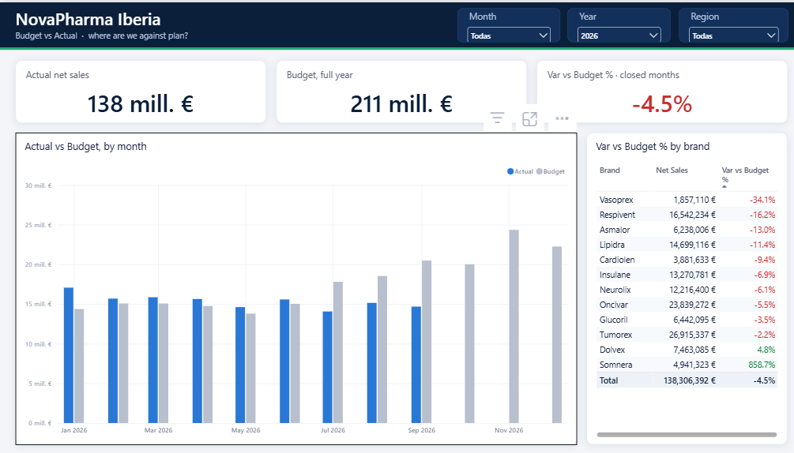
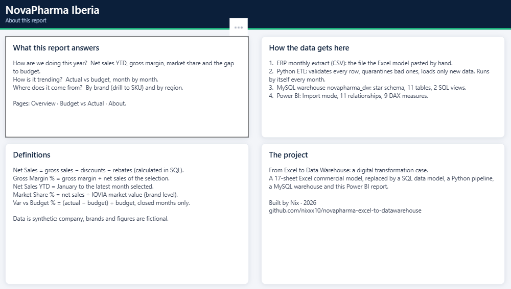

# Power BI report — Step 4

Power BI project (PBIP) connected to the MySQL warehouse `novapharma_dw` (Import mode, `localhost:3307`).

- `NovaPharma Iberia.pbip` — open this file in Power BI Desktop.
- `NovaPharma Iberia.SemanticModel/` — the model in TMDL: 9 tables, 11 relationships, 9 DAX measures in `_measures`.
- `NovaPharma Iberia.Report/` — the report in PBIR: 3 pages and the custom theme "NovaPharma Clinical".
- `screenshots/` — one image per page.

| Page | What it answers |
|---|---|
| Overview | How are we doing this year, how is it trending, where does it come from (brand, region) |
| Budget vs Actual | Where are we against plan, by month and by brand |
| About | What the report answers, how the data gets here, definitions |

The reviews of each sub-step are in `docs/Step4A_*.pdf`, `docs/Step4B_*.pdf` and `docs/Step4C_*.pdf`.
