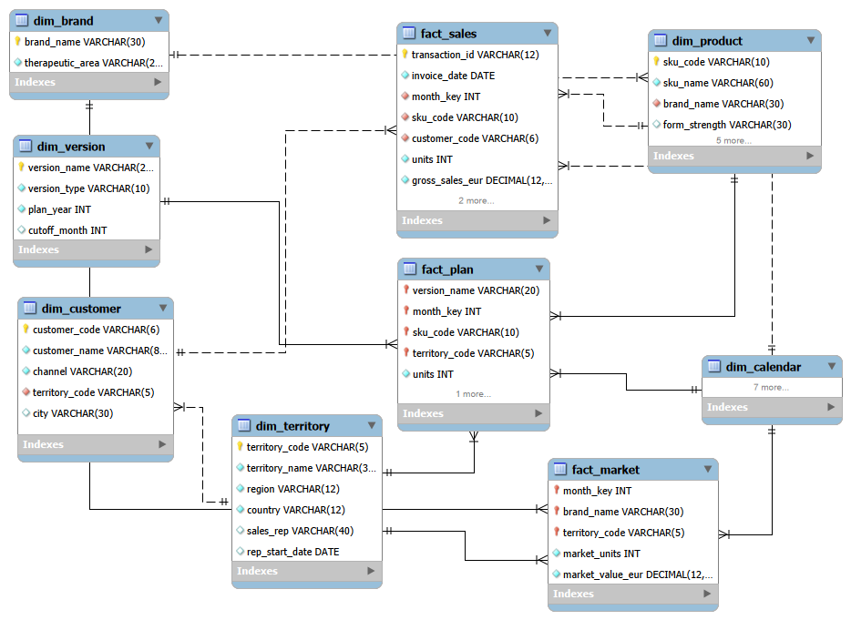

# NovaPharma Iberia — from an Excel model to a data warehouse

> **Status: in progress** (Steps 0–3 done, Step 4 Power BI next). Synthetic data, fictional company.

<!-- TODO (Nix): 3–4 sentences in your own words: what the Excel was, what the project does, why it matters for a pharma commercial team. -->

## The problem

<!-- TODO (Nix): the as-is situation — 17 sheets, 626k formulas, macros, silent NOT FOUND errors, one owner. See docs/Step0_Review_Excel_AsIs.pdf -->

## Target architecture

```
Excel (as-is)  ──►  Python ETL  ──►  MySQL warehouse  ──►  Power BI
                    (clean, load,     (constellation:       (2 pages,
                     log, schedule)    3 facts, 6 dims)      10 visuals)
```



## Steps

| Step | What | Where |
|---|---|---|
| 0 | Excel as-is: sheet dictionary, five layers found inside one file | `01_excel_as_is/`, `docs/Step0_*.pdf` |
| 1 | Reverse engineering the data model (type, grain, keys, measures) | `docs/Step1_*.pdf` |
| 2 | MySQL schema: DDL + ER diagram | `03_sql/01_schema.sql`, `02_data_model/` |
| 3.A | Python pipeline prototype: profile → rules → transform → load → reconcile | `04_python/01_pipeline_prototype.ipynb`, `docs/Step3A_*.pdf` |
| 3.B | Production script, idempotent monthly load, Task Scheduler | `04_python/etl_novapharma.py`, `docs/Step3B_*.pdf` |
| 4 | Power BI report | `05_powerbi/` (soon) |

## How to reproduce

1. MySQL 8: run `03_sql/01_schema.sql` (creates `novapharma_dw`, 11 tables).
2. `pip install -r requirements.txt`
3. Historical load: open `04_python/01_pipeline_prototype.ipynb`, set the Excel path, run all.
4. Monthly load: set the env var `NOVAPHARMA_DB_PWD`, adjust `04_python/config.ini`, then
   `python 04_python/etl_novapharma.py ERP_Sales_202609.csv`

## What I learned

<!-- TODO (Nix): the 3–5 things you'd tell an interviewer. Examples from the reviews: Excel hid 70 errors because VLOOKUP ignores case; one fact table per grain; nothing is deleted, it is quarantined; reconcile to the cent. -->

## Known limitations / backlog

<!-- TODO (Nix): from docs/Step3B_*.pdf backlog + dataset limitations (forecast versions only for 2026, etc.) -->

---
Author: Nizar El Ouarma · MIT License
