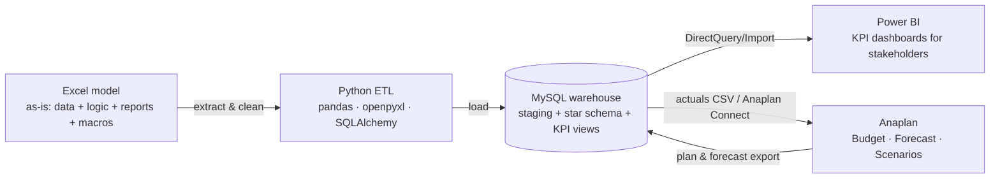

# NovaPharma Iberia — Commercial Data Transformation
## Project Design (Step 1)

**Owner:** Nix · **Purpose:** simulate an end-to-end digital transformation of a pharma commercial planning process, moving from an Excel-based model to MySQL + Python + Power BI + Anaplan, as preparation for an Anaplan Analyst role.

**Decisions taken so far:** business scope = commercial sales & forecast · SQL engine = MySQL · language = English · Anaplan access = to be requested via Anaplan Academy / Talent Builder Program (project does not depend on it).

---

## 1. Business context (the fictional company)

**NovaPharma Iberia** is the Spanish and Portuguese commercial affiliate of a mid-size pharmaceutical group. It sells ~12 brands (≈30 SKUs) across five therapeutic areas (Cardiovascular, Oncology, CNS, Respiratory, Diabetes) through three channels: hospitals, retail pharmacies (served through wholesalers) and direct tenders. The sales force is organised in 2 countries → 6 regions → 24 territories, each territory owned by one sales rep.

Every month, the Commercial Finance team receives a sales extract from the ERP, pastes it into a master workbook, refreshes a set of SUMIFS-based consolidation sheets, compares actuals with the annual budget and with the latest rolling forecast, and sends screenshots of pivot tables to management. The budget is built once a year in a separate workbook; the forecast is re-typed every quarter.

**Pain points that justify the transformation** (these become the "as-is" chapter of the documentation):

| Pain point | Symptom in the Excel model |
|---|---|
| Data and logic mixed in one file | Raw data, lookups, calculations and charts in the same workbook; one broken VLOOKUP silently corrupts the report |
| No single source of truth | Product and customer master lists maintained by hand in the workbook; budget lives in a different file with different codes |
| Manual, non-repeatable process | A macro imports the monthly file, but only one person knows how it works |
| Performance and size | 50k+ rows of transactions with tens of thousands of SUMIFS make the file slow and >40 MB |
| No versioning of plans | Forecast versions are overwritten; nobody can reproduce "what we said in Q1" |
| Reporting is static | Management gets screenshots; no drill-down, no self-service |

---

## 2. Target architecture

The Excel workbook is *replaced*, not migrated as one block. Each thing it does today moves to the layer built for it.

| Layer | What it replaces in Excel | Tool | Why this tool |
|---|---|---|---|
| Data storage (single source of truth) | Sales_Raw, master sheets, Budget sheet | **MySQL 8** | Free, widely used, native Power BI connector, easy from Python |
| Transformation / automation | VBA macros (import, validate, consolidate, export) | **Python** (pandas, openpyxl, SQLAlchemy + PyMySQL, Jupyter) | The role asks for it; code-based ETL is testable and documentable |
| Reporting & KPIs | Pivot tables, KPI sheet, charts | **Power BI Desktop** | Already installed; star-schema modelling + DAX; interactive drill-down |
| Planning (budget, forecast, what-if) | Budget / Forecast sheets, "version" copies | **Anaplan** | Purpose-built planning platform; the target job |

Key concept for the interview: this is a **closed loop**. Actuals flow ERP → MySQL → Anaplan; the plan built in Anaplan flows back to MySQL so Power BI can show *Actual vs Budget vs Forecast* in one place. Anaplan is not a reporting tool and not a database.

### Platform screening (what was considered and why it was discarded)

| Layer | Considered | Decision |
|---|---|---|
| SQL | SQL Server Express, PostgreSQL, **MySQL**, SQLite/DuckDB | MySQL chosen by Nix. SQLite/DuckDB discarded: no native Power BI connector, looks like a toy in an interview. |
| ETL | **Python**, Power Query, Alteryx, SSIS | Python: required by the job description, free, version-controllable. Power Query is still used *inside* Power BI for light shaping. |
| BI | **Power BI**, Tableau, Excel pivots | Power BI: installed, market standard alongside Anaplan, DAX practice. |
| Planning | **Anaplan**, Excel, Pigment, Board | Anaplan: target role. Free learner workspace via Anaplan Academy Talent Builder Program (90 days, extendable). |

---

## 3. Data model

### Dimensions (master data)

| Table | Grain | Key attributes |
|---|---|---|
| `dim_product` | SKU | sku_code, sku_name, brand, therapeutic_area, form/strength, launch_date, loe_date (loss of exclusivity), list_price, cogs_per_unit, status |
| `dim_customer` | Account | customer_code, customer_name, channel (Hospital / Retail-Wholesaler / Tender), territory_code, city |
| `dim_territory` | Territory | territory_code, territory_name, region, country, sales_rep, rep_start_date |
| `dim_calendar` | Month | month_key (YYYYMM), month_start, year, quarter, fiscal_period, is_closed |
| `dim_version` | Plan version | Actual, Budget 2025, Budget 2026, FC Q1-26, FC Q2-26, … |

### Facts

| Table | Grain | Measures |
|---|---|---|
| `fact_sales` (actuals) | month × SKU × customer | units, gross_sales, discounts, rebates, net_sales, cogs |
| `fact_plan` (budget + forecasts) | month × SKU × territory × version | units, net_sales |
| `fact_market` (IQVIA-style) | month × brand × territory | market_units, market_value |

Target size: ~36 months (Jan-2024 → Dec-2026), ~50–60k sales rows, ~25k plan rows, ~5k market rows. Large enough to make Excel struggle, small enough to open.

Built-in realism: two product launches during the period, one brand losing exclusivity in 2025 with generic erosion, seasonality in Respiratory, a rep vacancy in one territory, deliberate data-quality issues in the raw data (duplicated rows, a customer code missing from the master, inconsistent SKU casing, a negative-units return) so the ETL has something to fix.

### KPIs (for Power BI and Anaplan)

Net Sales · Units · Average Selling Price · Gross-to-Net % · Gross Margin % · Sales vs Budget (abs & %) · Sales vs Forecast · Forecast accuracy (MAPE) · YoY growth · Market share (units) · LoE erosion curve · Net Sales per territory / per rep · Run-rate vs full-year budget.

---

## 4. The Excel model (Step 2 specification)

File: `NovaPharma_Commercial_Model.xlsx` + VBA modules (`.bas` files to import) → saved as `.xlsm`.

| Sheet | Role | Excel skills it demonstrates |
|---|---|---|
| `README` | How the model works, refresh procedure | Documentation |
| `Parameters` | Current month, FX rates, version selector, thresholds | Named ranges, data validation |
| `Calendar`, `Products`, `Customers`, `Territories` | Master data (tables) | Structured tables |
| `Sales_Raw` | ~50k transaction rows as they arrive from ERP | Large data set |
| `Sales_Enriched` | Raw rows enriched with brand, TA, channel, region, rep | **VLOOKUP, XLOOKUP, INDEX/MATCH**, IFERROR |
| `Budget`, `Forecast` | Plan by month × SKU × territory × version | Structured input |
| `Consolidation` | Net sales / units by brand × region × month | **SUMIFS, COUNTIFS, AVERAGEIFS, SUMPRODUCT** |
| `BvA` | Actual vs Budget vs Forecast variances with conditional formatting | SUMIFS across versions, % variance, traffic lights |
| `KPI_Dashboard` | Management view: YTD, run-rate, market share, top brands | Mixed formulas + charts |
| `Data_Quality` | Checks: orphan codes, duplicates, negative units | COUNTIFS, MATCH, conditional formatting |
| `Import_Staging` | Landing zone for the monthly ERP file | Used by macros |

**Macros (VBA):** `ImportMonthlyFile` (opens the ERP CSV, appends to Sales_Raw, stamps load date) · `RefreshConsolidation` (recalculates, refreshes pivots, updates "last refresh") · `ValidateData` (runs the Data_Quality checks, lists errors in a log sheet) · `SnapshotForecastVersion` (copies current forecast into a new version column) · `ExportToCSV` (writes each master/fact sheet to CSV — the very files the Python ETL will consume).

---

## 5. Migration plan (Steps 3–5)

| Phase | Work | Deliverables | Where it runs |
|---|---|---|---|
| **0. Environment** | Install MySQL 8 + Workbench, Python 3 + libs, MySQL Connector/NET for Power BI; register on Anaplan Academy and request Talent Builder workspace | Setup checklist | Nix's PC |
| **1. As-is model** | Build the Excel workbook and macros; run the monthly process by hand once | `.xlsm`, `.bas` modules | Claude builds, Nix imports VBA |
| **2. Profile & extract** | Python reads every sheet, profiles the data, produces a data-quality report, exports clean CSVs | `01_profile.ipynb`, DQ report | Nix's PC |
| **3. Warehouse** | DDL for staging + star schema; Python load; SQL views for each KPI; reconciliation Excel totals = SQL totals | `ddl/*.sql`, `02_load.py`, `views/*.sql`, reconciliation table | MySQL |
| **4. Reporting** | Power BI model on the star schema, DAX measures, stakeholder dashboard (Exec summary, Brand performance, Territory, BvA) | `.pbix` | Power BI Desktop |
| **5. Planning** | Anaplan model blueprint (lists, hierarchies, modules, line items, versions, import actions, dashboards); export "Anaplan-ready" files from MySQL; build in Anaplan when workspace is granted; export plan back to MySQL | Blueprint doc, CSV load files, Anaplan model | Anaplan |
| **6. Documentation** | Nix writes the story step by step in his own words; Claude supplies the checkpoints, the questions to answer and reviews clarity | Project write-up (portfolio + interview script) | Project docs |

Order of execution: 0 → 1 → 2 → 3 → 4 → 5, with 6 running in parallel (a short write-up after every phase, while it is fresh).

---

## 6. Documentation approach

Nix writes; Claude does not write the narrative for him. After each phase Claude provides (a) a list of the decisions that were taken and why, (b) three to five questions an interviewer would ask about that phase, and (c) a review of the draft for accuracy and clarity. The final document has one chapter per phase: *what the problem was, what we decided, how we did it, what we would do differently*.

---

## 7. Mapping to the job description

| Job requirement | Where it is covered |
|---|---|
| Strong Excel skillset | The as-is model: tables, named ranges, data validation, charts |
| Develop macros | The five VBA modules, imported and run by Nix |
| Model large data sets with Lookups and SumIf | `Sales_Enriched` (VLOOKUP / XLOOKUP / INDEX-MATCH), `Consolidation` and `BvA` (SUMIFS family) on 50k+ rows |
| Anaplan model building | Blueprint + build: lists, modules, line items, versions, imports, dashboards |
| Data integration | Python ETL, MySQL star schema, Anaplan import actions, closed loop |
| Stakeholder reporting | Power BI KPI dashboard |

---

## 8. Immediate next actions

1. Nix: register on Anaplan Academy, complete "The Anaplan Way", request the Talent Builder workspace (talentbuilder@anaplan.com).
2. Nix: install MySQL 8 Community + Workbench, Python 3.11+ (`pip install pandas openpyxl sqlalchemy pymysql jupyter`), MySQL Connector/NET.
3. Nix: connect a project folder from the desktop app so deliverables are saved directly on the PC.
4. Claude: build the Excel model (Step 2).
